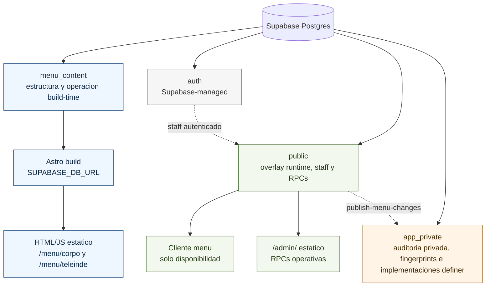
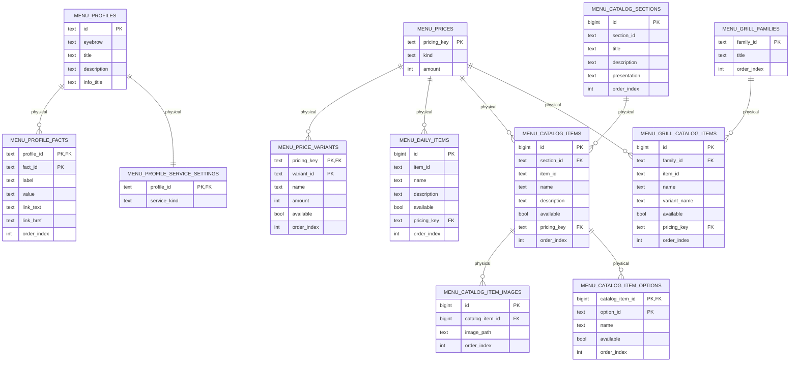
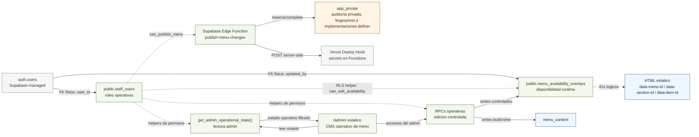

# Supabase database map

Este mapa documenta el modelo activo del menu QR. Supabase se usa como fuente estructural y operativa build-time; la unica superficie runtime sin rebuild es el overlay de disponibilidad.

Las columnas `available` dentro de `menu_content` son compatibilidad interna y deben permanecer en `true`. La disponibilidad operativa real se modela solo como excepcion runtime en `public.menu_availability_overlays`.

Fuentes versionadas:

- `../../supabase/migrations/`: baseline prelanzamiento canonico y migraciones posteriores.
- `audits/menu-schema-audit.sql`: auditoria read-only del modelo activo.
- `audits/database-audit.sql`: inventario amplio de objetos, exposicion y hallazgos.

Ver `README.md` en esta carpeta para las reglas del baseline y cambios posteriores.

## Mapa de schemas

## ERD resumido: `menu_content`

El ERD muestra las tablas y columnas de dominio mas relevantes. La migracion baseline sigue siendo la referencia exacta de constraints, defaults y checks.

## Runtime operativo

## Frontera build-time/runtime

- `menu_content` se lee para el menu publico solo durante build/validacion con `SUPABASE_DB_URL`.
- Menu del dia, descripcion, servicio activo por local, catalogo, secciones, imagenes y precios son datos build-time.
- Las columnas build-time `available` no representan faltantes operativos; se conservan siempre `true` por compatibilidad.
- `menu_daily_items` modela dos opciones planas: comun y vegetariano.
- `menu_catalog_item_images` es la unica fuente de imagenes: el orden cero es la imagen principal de cada item del catalogo fijo.
- Menu diario y parrilla no soportan imagenes.
- `/admin/` funciona como CMS operativo de contenido de menu: cubre disponibilidad, servicio activo, menu del dia, productos de parrilla y sus opciones, contenido de menu fijo, opciones de items que ya usan opciones, precios y publicacion.
- `/admin/` puede editar datos operativos build-time, pero esos cambios requieren rebuild/deploy para impactar el menu publico.
- La edicion de menu fijo desde `/admin/` cubre altas, bajas y cambios de nombre/descripcion de items puntuales dentro de secciones existentes, y altas, bajas o cambios de opciones de items que ya usan opciones; no abre CMS editorial general ni edicion libre de secciones, IDs u orden.
- `public.menu_availability_overlays` es el unico dato editable en runtime sin rebuild.
- La ausencia de overlay equivale a disponible; marcar disponible en admin debe limpiar el overlay.
- Los items con opciones exponen target padre y targets de opcion; las opciones usan IDs compuestos `item-id-option-id` como `item_id` del overlay.
- `public.staff_users` define roles operativos (`operator`, `admin`); `operator` puede editar todos los perfiles y publicar.
- `staff_users.default_availability_profile_id` solo preselecciona el filtro de disponibilidad de `/admin/`; no restringe permisos por local.
- Las escrituras del admin deben pasar por RPCs operativas con respuesta `ok`, `changed`, `requires_redeploy`, `operation` y `message`.
- Las RPCs publicas del admin son wrappers `security invoker`; las implementaciones privilegiadas viven en `app_private`, que no debe exponerse por PostgREST.
- `publish-menu-changes` es la frontera server-side para publicar cambios build-time: valida Auth, usa `can_publish_menu()`, registra auditoria privada con fingerprint del contenido y llama el Deploy Hook desde secretos.
- El estado `publication` expone el fingerprint build-time actual; `/admin/` lo compara contra el fingerprint embebido en el deploy estatico actual para decidir si falta publicar.
- `public.editor_profiles` fue eliminada luego del backfill inicial; `staff_users` es la unica fuente de permisos operativos.
- El cliente no debe consultar estructura, precios, menu del dia, servicio activo, catalogo, secciones, imagenes ni textos estructurales.
