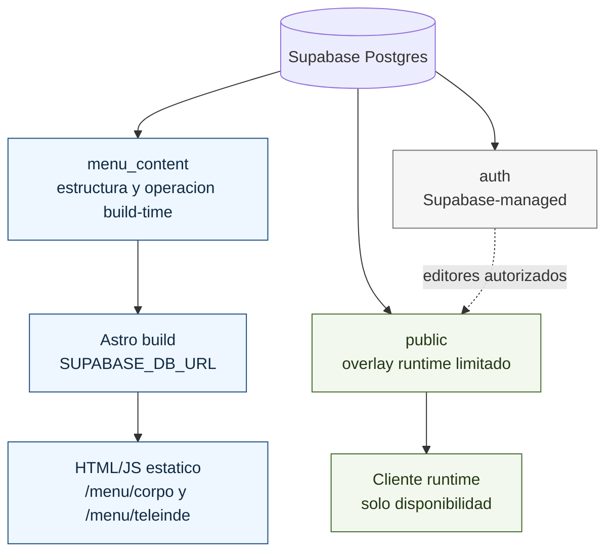
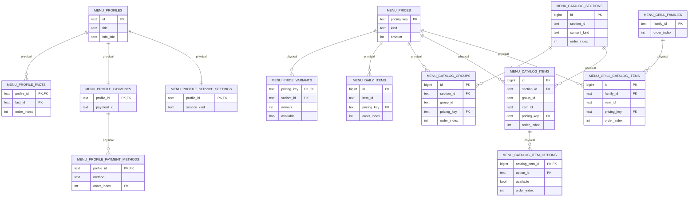
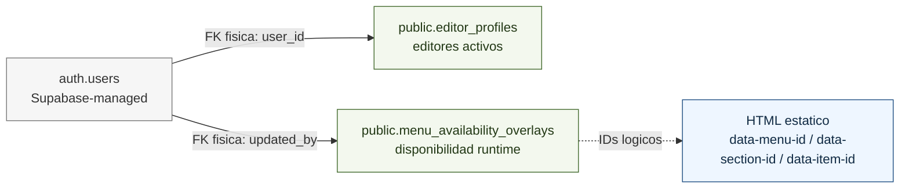

# Supabase database map

Este mapa documenta el modelo activo del menu QR. Supabase se usa como fuente
estructural y operativa build-time; la unica superficie runtime sin rebuild es el
overlay de disponibilidad.

Fuentes versionadas:

- `schema.sql`: estado limpio esperado del schema privado `menu_content`.
- `migrations/2026-05-07-flatten-menu-content-model.sql`: primera migracion remota al modelo plano.
- `migrations/2026-05-07-drop-legacy-menu-content-model.sql`: limpieza de tablas legacy despues de validar deploy.
- `availability-overlay.sql`: unica superficie runtime en `public`.
- `audits/menu-schema-audit.sql`: auditoria read-only del modelo activo.
- `audits/database-audit.sql`: inventario amplio de objetos, exposicion y hallazgos.

## Mapa de schemas

## ERD activo: `menu_content`

## Overlay runtime: `public`

## Frontera build-time/runtime

- `menu_content` se lee solo durante build/validacion con `SUPABASE_DB_URL`.
- Menu del dia, notas, servicio activo por local, catalogo, secciones, grupos, imagenes y precios son datos build-time.
- Un CMS futuro puede editar esos datos, pero el cambio requiere rebuild/deploy para impactar el menu publico.
- `public.menu_availability_overlays` es el unico dato editable en runtime sin rebuild.
- El cliente no debe consultar estructura, precios, menu del dia, servicio activo, catalogo, grupos, secciones, imagenes ni textos estructurales.

## Legacy

El modelo anterior se conservo durante la primera migracion remota para validar
deploy. La limpieza fisica vive en `2026-05-07-drop-legacy-menu-content-model.sql`
y no forma parte del modelo activo.
