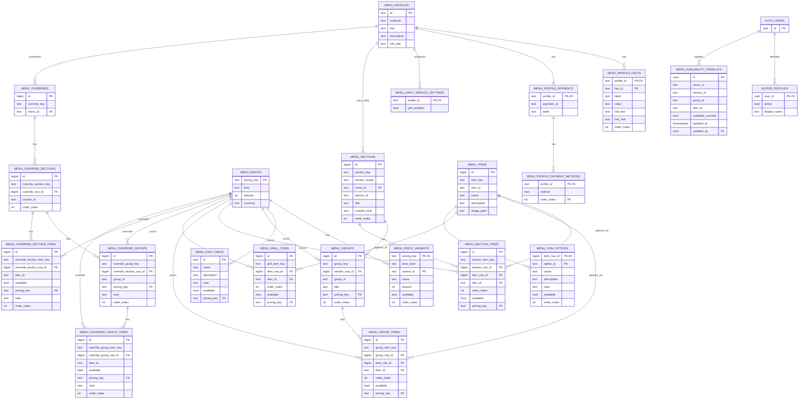

# Supabase schema diagram

El diagrama separa la fuente estructural build-time (`menu_content`) del overlay runtime
en `public`. Las relaciones de overrides apuntan a IDs tecnicos estables y se validan
por audits/scripts; no todas son foreign keys fisicas.

## Notas

- `menu_sections.section_scope = 'catalog'` usa `menu_id = null`; `section_scope = 'daily'` usa un `menu_id` de `menu_profiles`.
- `menu_daily_menu` es singleton: solo permite el id `current`.
- `menu_grill_items` representa la lista fija de parrilla usada cuando `grill_enabled` esta activo para un perfil.
- Los overrides solo pueden ajustar disponibilidad, precio y nota sobre estructura existente.
- `menu_availability_overlays` no cambia estructura, textos, precios ni imagenes; solo disponibilidad visual runtime.
