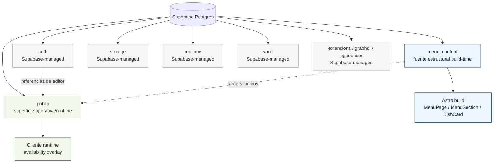
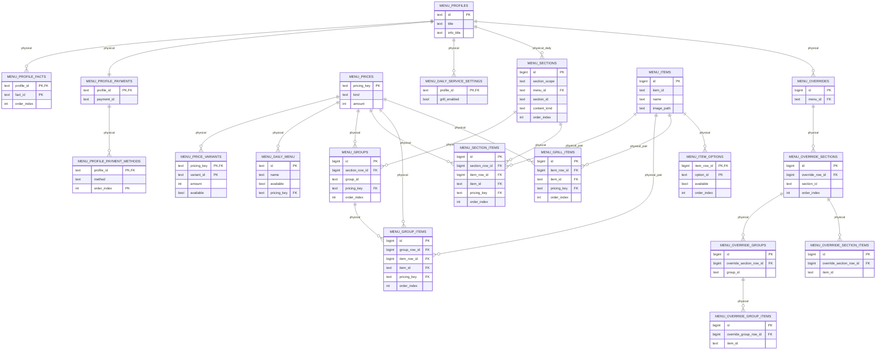
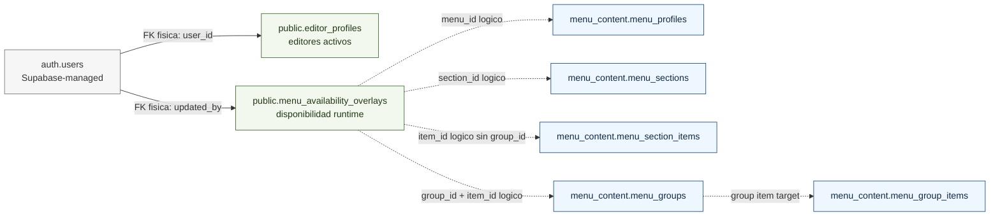
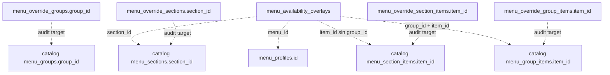

# Supabase database map

Este es el mapa versionado para entender la base Supabase del menu QR. Resume las
superficies reales del proyecto sin expandir tablas internas de Supabase.

Fuentes versionadas:

- `schema.sql`: estructura privada `menu_content`.
- `availability-overlay.sql`: superficie runtime en `public`.
- `audits/database-audit.sql`: inventario, exposicion, objetos inesperados y hallazgos.

## Como leer este mapa

1. Empezar por el mapa de schemas para separar proyecto de infraestructura.
2. Leer el ERD estructural de `menu_content`; esa es la fuente build-time del menu.
3. Leer el overlay runtime en `public`; solo cambia disponibilidad visual.
4. Usar la leyenda de auditoria para interpretar hallazgos, no para borrar datos.

Convenciones:

- Relacion fisica: foreign key declarada en SQL.
- Relacion logica: referencia por IDs tecnicos, validada por audits/scripts.
- Las tablas internas de Supabase se muestran como infraestructura y no se expanden.

## Mapa de schemas

## ERD estructural: `menu_content`

## Overlay runtime: `public`

El overlay no administra estructura, textos, precios, imagenes ni menu diario. Si el
overlay falla, el menu estatico generado en build-time sigue disponible.

## Relaciones logicas auditadas

Estas relaciones son intencionalmente logicas: preservan IDs tecnicos estables sobre
estructura existente y se revisan con `audits/database-audit.sql` y `npm run menu:validate`.

## Leyenda de auditoria

| Status | Significado | Accion |
| --- | --- | --- |
| `keep` | Esperado o necesario para el modelo actual. | Mantener y validar con audits. |
| `review` | Puede ser valido, pero requiere lectura humana. | Revisar uso, contexto y runtime antes de decidir. |
| `risk` | Exposicion, permiso o inconsistencia a corregir. | Preparar correccion separada y aprobada. |
| `unknown` | No hay evidencia suficiente para clasificar. | Identificar propietario y uso. |
| `do_not_touch` | Infraestructura Supabase o alto riesgo de romper plataforma. | No editar ni borrar directamente. |

## Notas operativas

- `menu_sections.section_scope = 'catalog'` usa `menu_id = null`; `section_scope = 'daily'` usa un `menu_id` de `menu_profiles`.
- `menu_daily_menu` es singleton: solo permite el id `current`.
- `menu_grill_items` representa la lista fija de parrilla usada cuando `grill_enabled` esta activo para un perfil.
- Los overrides solo pueden ajustar disponibilidad y nota sobre estructura existente.
- Los precios son globales y no pueden cambiar por local/menu mediante overrides.
- Las imagenes se validan como paths permitidos bajo `/uploads/`; su existencia fisica requiere comparar contra el inventario del repo.
- Cualquier limpieza futura debe vivir en otro SQL separado, transaccional y no ejecutado sin aprobacion explicita.
